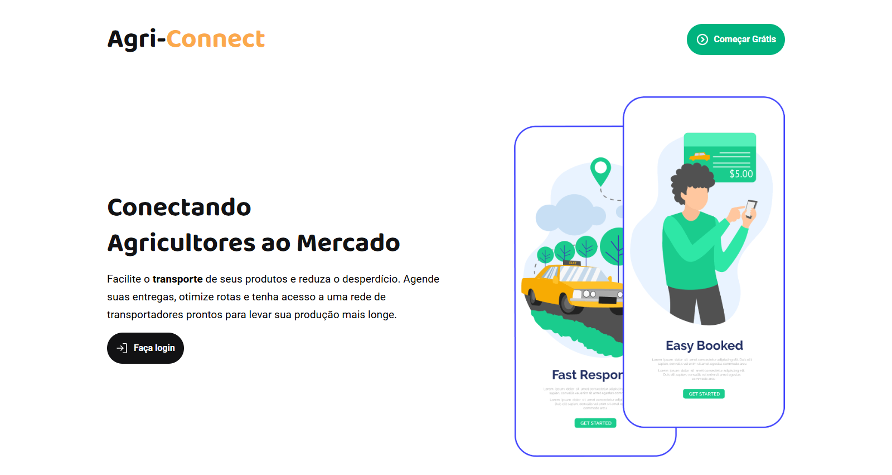
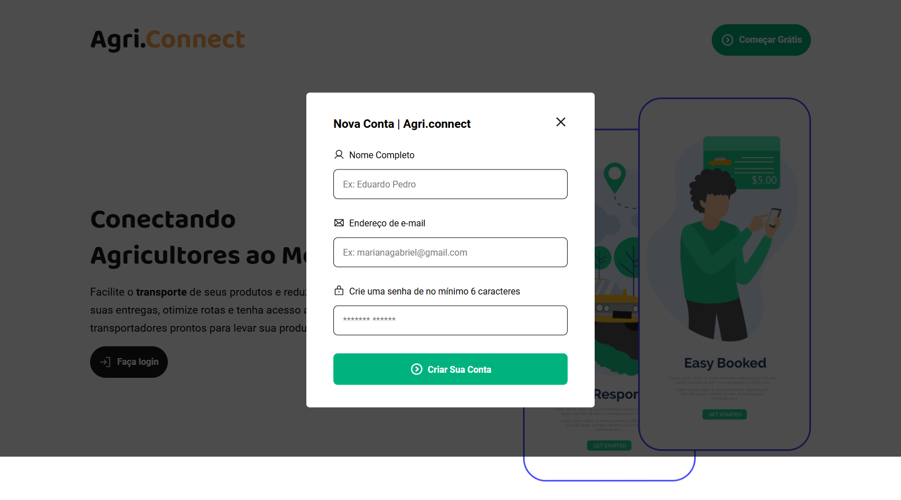
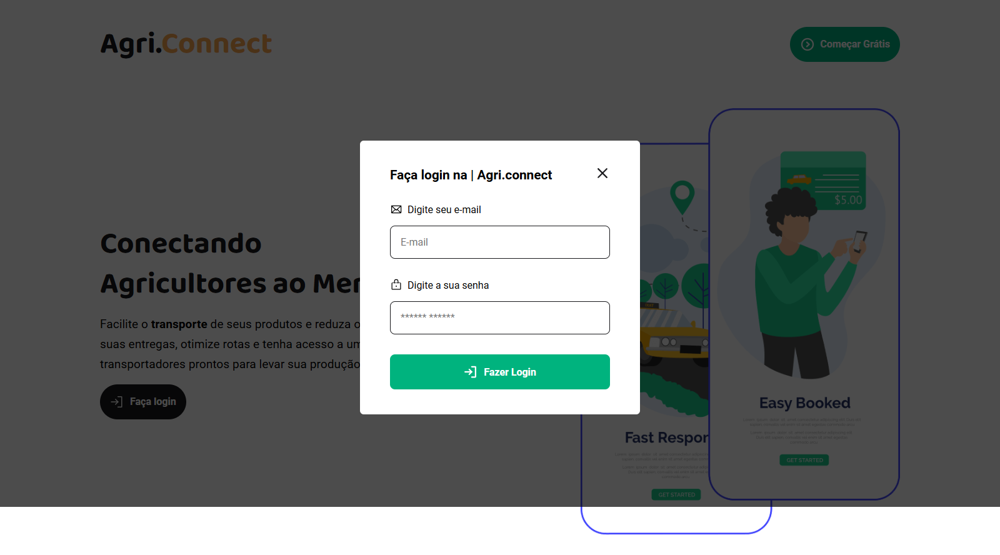
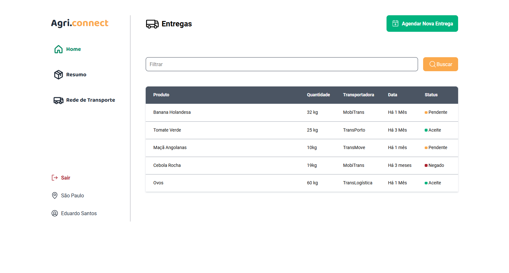
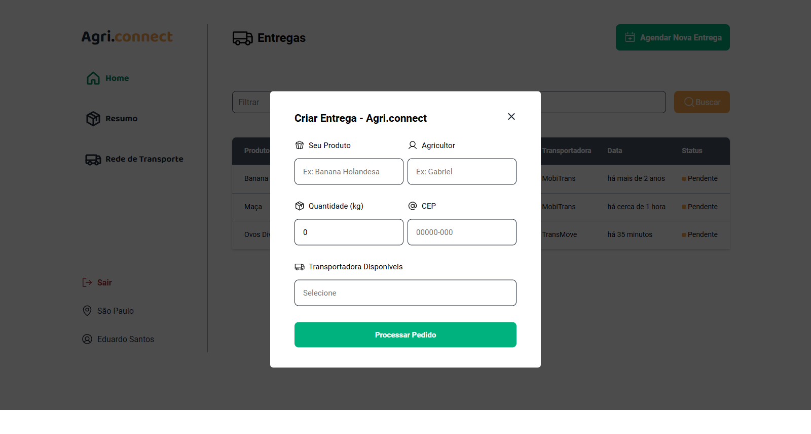
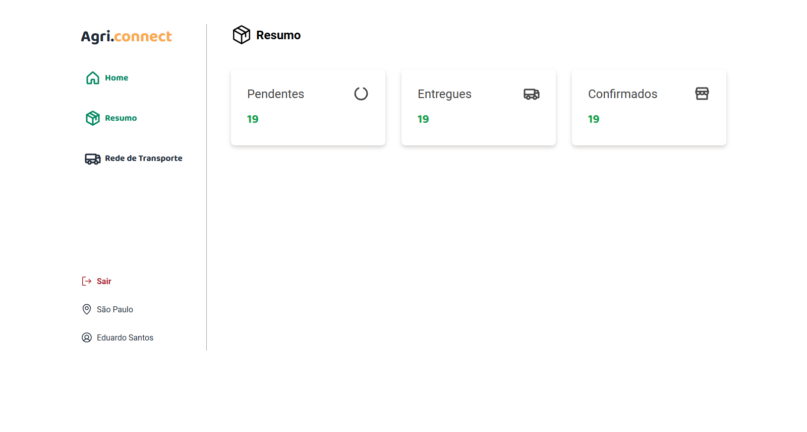

# Agri-connect

platform that connects small farmers to local transporters, facilitating delivery scheduling and optimizing the logistics of moving agricultural products to markets and consumers.

# Layouts 

> Página Inicial 

> Modal de Registro de Agricultor  

> Modal de Login do Agricultor  

> Layout do Dashboard  

> Layout do Cadastro de Agendamento

> Layout do Resumo 

# Tecnologias no Front

1. React 
2. Typescript 
3. Styled-components 
4. React Hook Form 
5. Reac
6. Zod Validation 

# Requisítos Funcionais 
> 1- Cadastro do agricultor

> 2- Login do Agricultor 

> 3- Cadastro de Entrega
 
> 4- Resumo das Entregas
 
> 5- Optimização de Rotas
 